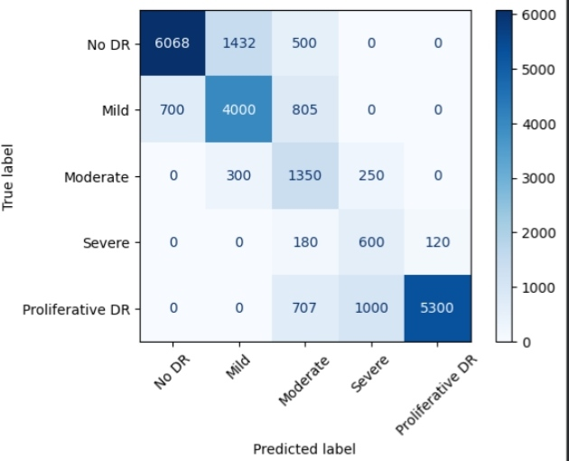
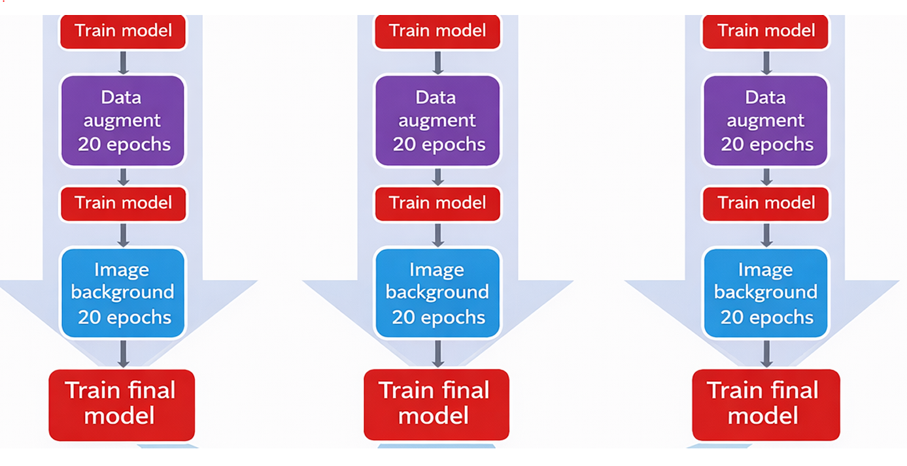
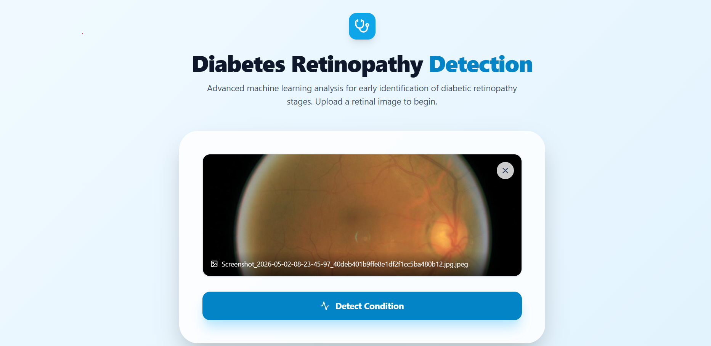

# 🩺 Diabetic Retinopathy Detection using Deep Learning


## 📖 Overview

Diabetic Retinopathy (DR) is one of the leading causes of blindness among diabetic patients. Early diagnosis can significantly reduce the risk of vision loss.

This project presents an automated Deep Learning-based system for detecting and classifying Diabetic Retinopathy from retinal fundus images. The model utilizes Transfer Learning with DenseNet121 and custom image preprocessing techniques to improve retinal feature extraction and classification performance.

The system classifies retinal images into five severity levels, helping support early diagnosis and treatment planning.

---

## 🎯 Project Objectives

- Detect Diabetic Retinopathy from retinal fundus images.
- Classify images into five disease severity stages.
- Apply advanced image preprocessing techniques.
- Utilize Transfer Learning to improve classification accuracy.
- Evaluate model performance using multiple metrics.

---

## 🏥 Diabetic Retinopathy Severity Classes

| Class | Severity Level |
|---------|---------------|
| 0 | No Diabetic Retinopathy |
| 1 | Mild |
| 2 | Moderate |
| 3 | Severe |
| 4 | Proliferative Diabetic Retinopathy |

---

## 📂 Dataset

The project uses the Diabetic Retinopathy Resized Dataset containing retinal fundus images and corresponding labels.

### Dataset Statistics

- Total Images: 35,108
- Number of Classes: 5
- Image Format: JPEG
- Input Resolution: 224 × 224

### Class Distribution

| Class | Samples |
|---------|---------|
| No DR | 25,802 |
| Mild | 2,438 |
| Moderate | 5,288 |
| Severe | 872 |
| Proliferative DR | 708 |

---

## 🛠️ Technologies Used

- Python
- TensorFlow
- Keras
- OpenCV
- NumPy
- Pandas
- Matplotlib
- Scikit-Learn
- Google Colab

---

## 🔍 Image Preprocessing

To enhance retinal features and improve model learning, several preprocessing techniques were applied:

### 1. Histogram Equalization

Enhances image contrast and improves visibility of retinal structures.

### 2. Gaussian Blur Enhancement

Improves vessel visibility and highlights important retinal patterns.

### 3. Custom Krish Feature Extraction

A custom convolution-based feature extraction method designed to emphasize retinal abnormalities and blood vessel structures before feeding images into the deep learning model.

---


## 🧠 Model Architecture

### Transfer Learning Model: DenseNet121

The model uses DenseNet121 pretrained on ImageNet for feature extraction.

### Architecture

```text
Input Image (224×224×3)
        ↓
DenseNet121 (Pretrained)
        ↓
Flatten Layer
        ↓
Dense Layer (512 Units, ReLU)
        ↓
Dropout Layer (0.2)
        ↓
Dense Layer (5 Units, Softmax)
        ↓
Output Classification
```

### Training Configuration

| Parameter | Value |
|------------|---------|
| Input Size | 224 × 224 |
| Batch Size | 32 |
| Epochs | 20 |
| Optimizer | Adam |
| Loss Function | Sparse Categorical Crossentropy |
| Output Classes | 5 |

---

## 📊 Training Pipeline

```text
Dataset
    ↓
Data Cleaning
    ↓
Image Preprocessing
    ↓
Train-Test Split
    ↓
Transfer Learning (DenseNet121)
    ↓
Model Training
    ↓
Performance Evaluation
    ↓
Model Saving (.h5)
```

---

## 📈 Results

### Overall Accuracy

**76% Accuracy**

### Classification Report

| Class | Precision | Recall | F1-Score |
|---------|---------|---------|---------|
| No DR | 0.90 | 0.80 | 0.85 |
| Mild | 0.74 | 0.73 | 0.73 |
| Moderate | 0.38 | 0.71 | 0.50 |
| Severe | 0.32 | 0.67 | 0.44 |
| Proliferative DR | 0.98 | 0.76 | 0.85 |

### Weighted Average

- Precision: 0.82
- Recall: 0.76
- F1-Score: 0.78

---

## 📉 Confusion Matrix



---

## 📈 ROC Curve


---

## 💾 Saved Model

```bash
diabetic_retinopathy_model.h5
```

---

## 📁 Project Structure

```bash
Diabetic-Retinopathy-Detection/
│
├── dataset/
│   ├── resized_train_cropped/
│   └── trainLabels_cropped.csv
│
├── notebooks/
│   └── diabetic_retinopathy_detection.ipynb
│
├── models/
│   └── diabetic_retinopathy_model.h5
│
├── images/
│   ├── original_retina.png
│   ├── histogram_equalization.png
│   ├── gaussian_enhancement.png
│   ├── krish_feature_extraction.png
│   ├── confusion_matrix.png
│   └── roc_curve.png
│
├── requirements.txt
├── README.md
└── LICENSE
```


## 📈 flow chart




---

## 🚀 Future Improvements

- Fine-tune DenseNet121 layers.
- Apply class balancing techniques.
- Use advanced augmentation strategies.
- Deploy using Streamlit or Flask.
- Add Grad-CAM visualization for explainable AI.
- Train on the complete dataset for improved performance.

---

## 🌟 Key Features

✅ Automated Diabetic Retinopathy Detection

✅ Transfer Learning with DenseNet121

✅ Custom Retinal Feature Extraction

✅ Multi-Class Disease Classification

✅ Confusion Matrix & ROC Analysis

✅ TensorFlow/Keras Implementation

✅ Deployment Ready

## 📈 User Interface




---

## 👨‍💻 Author

### Praveen Rana

B.Tech – Computer Science & Engineering

Machine Learning & Deep Learning Enthusiast

Passionate about AI-powered Healthcare Solutions

### Connect With Me

- LinkedIn: https://linkedin.com/in/your-profile
- GitHub: https://github.com/your-username

---

## ⭐ If you found this project useful, please give it a star!
